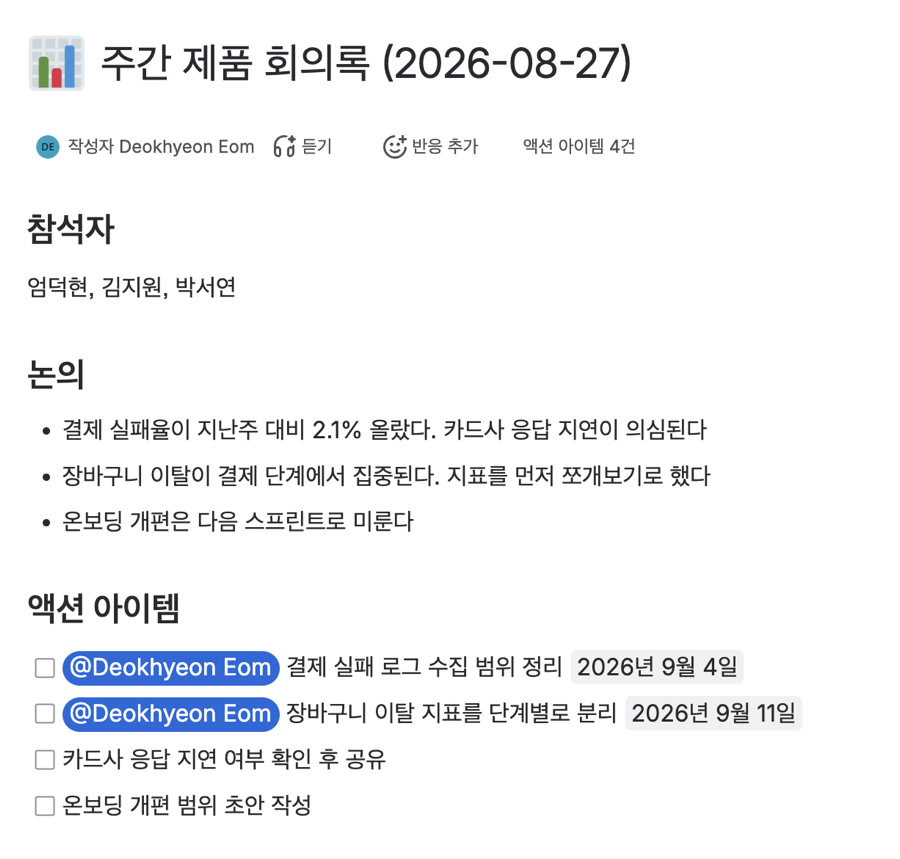
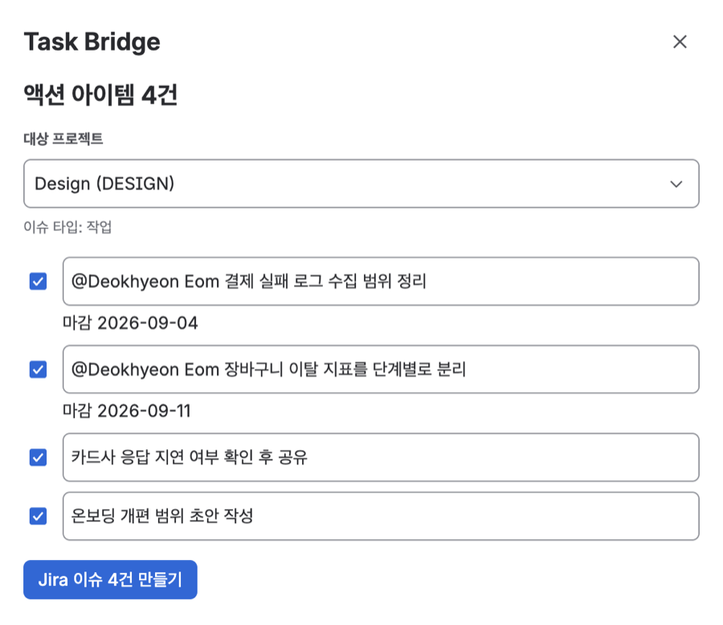
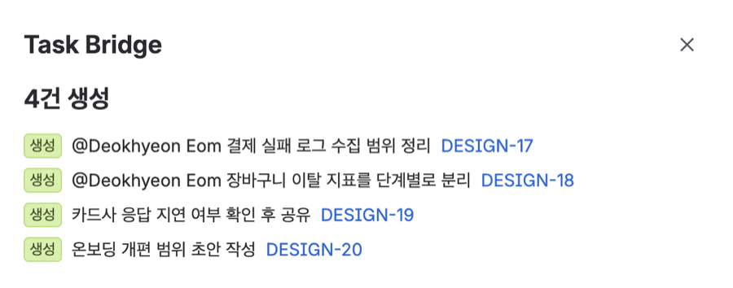
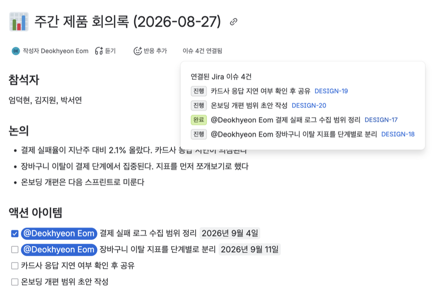

# Task Bridge

Confluence 회의록에 흩어진 액션 아이템을 Jira 이슈로 한 번에 옮기고, 그 이슈가 완료되면
회의록 체크박스에 되돌려 반영하는 Atlassian Forge 앱이다.

회의록과 이슈 트래커를 둘 다 쓰는 팀은 많은데 그 사이는 대개 손으로 이어져 있다. 두 제품을
한 앱에서 잇는 일은 각 제품의 API 를 밖에서 호출해도 되지만, 그러면 인증과 배포와 권한을
직접 떠안아야 한다. 

Forge 는 같은 사이트의 Jira 와 Confluence 를 한 앱에서 사용자 자격으로 부를 수 있고,
인증과 배포는 플랫폼이 맡는다. 회의록과 이슈를 오가는 이 주제에는 그게 그대로 필요하다.

<table>
  <tr>
    <td></td>
    <td></td>
  </tr>
  <tr>
    <td>회의록에 액션 아이템이 논의와 섞여 있다</td>
    <td>옮길 항목을 고르고 대상 프로젝트를 정한다</td>
  </tr>
  <tr>
    <td></td>
    <td></td>
  </tr>
  <tr>
    <td>이슈가 만들어지고 키를 눌러 바로 건너뛴다</td>
    <td>이슈를 완료하면 회의록 체크박스에 반영된다</td>
  </tr>
</table>

## 문제

주간 회의가 끝나면 회의록에 액션 아이템이 남는다. 담당자도 적혀 있고 마감일도 적혀 있다.
그런데 일은 Jira 에서 굴러간다. 누군가 그 항목들을 하나씩 이슈로 옮긴다. 제목을 다시
타이핑하고, 담당자를 다시 고르고, 마감일을 다시 입력한다.

그다음이 더 문제다. 이슈가 완료돼도 회의록은 그대로다. 다음 회의에서 회의록을 열면 지난주
액션 아이템이 전부 미완료로 보인다. 무엇이 끝났는지 알려면 Jira 를 따로 열어 하나씩
맞춰봐야 한다.

**추적이 끊기는 지점이 두 곳이다. 옮길 때 한 번, 끝났을 때 한 번.** 이 앱은 그 둘을 잇는다.

## 기능

| Confluence 회의록 | | Jira 이슈 |
|---|---|---|
| ☐ 결제 실패 로그 정리<br>@담당자, 2026-09-04 | **정방향 →**<br>제목, 담당자, 마감일 | DESIGN-17<br>담당자 지정<br>기한 2026-09-04 |
| ☑ 결제 실패 로그 정리 | **← 역방향**<br>완료되면 체크 | DESIGN-17 완료 |

**정방향**은 사람이 누른다. 회의록 더보기 메뉴에서 Task Bridge 를 열면 그 페이지의 미완료
액션 아이템이 나온다. 옮길 것을 고르고, 제목을 그 자리에서 고칠 수 있고, 대상 프로젝트를
정하면 이슈가 만들어진다.

- 액션 아이템 본문을 이슈 제목으로 바꾼다. 멘션은 표시 이름으로, 링크는 URL 로 눌러 한 줄로 만든다
- 멘션된 사람을 담당자로 지정한다. 그 프로젝트를 쓸 수 없는 사람이면 담당자 없이 만든다
- 회의록에 적힌 마감일을 이슈 기한으로 옮긴다
- 이슈 본문에 회의록 링크를 넣어 Jira 에서 원본으로 돌아갈 수 있게 한다
- 이미 옮긴 항목은 이슈 키를 함께 보여준다. 다시 만드는 것을 막지는 않는다

**역방향**은 사람이 없는 곳에서 돈다. Jira 이슈 상태가 바뀌면 트리거가 깨어나 연결된
회의록 태스크를 찾아 체크하거나 체크를 푼다. 되돌리기는 앱이 체크한 것에만 적용해서,
사람이 회의록에서 직접 체크해둔 항목은 건드리지 않는다.

반영이 거부되면 그 이슈에 댓글로 알린다. 회의록에서 항목이 지워졌거나 앱에 편집 권한이
없는 경우다. 트리거는 화면이 없어서 알리지 않으면 아무도 모른다.

**회의록 쪽에도 연결이 보인다.** 페이지 제목 아래에 `이슈 4건 연결됨` 이 뜨고, 누르면
연결된 이슈와 각 상태가 나온다. 회의록을 읽는 사람은 더보기 메뉴를 열지 않기 때문이다.

## 실행

### 설치해서 써보기

Jira 와 Confluence 가 함께 있는 Atlassian 사이트가 있고 그 사이트의 관리자라면, 아래 링크로
바로 설치할 수 있다.

**[Task Bridge 설치하기](https://developer.atlassian.com/console/install/ca158947-1ec7-4cc1-aa54-fa5da6537739?signature=AYABeL9jgQt4XDzaNzDRARDuSkAAAAADAAdhd3Mta21zAEthcm46YXdzOmttczp1cy13ZXN0LTI6NzA5NTg3ODM1MjQzOmtleS83MDVlZDY3MC1mNTdjLTQxYjUtOWY5Yi1lM2YyZGNjMTQ2ZTcAuAECAQB4IOp8r3eKNYw8z2v%2FEq3%2FfvrZguoGsXpNSaDveR%2FF%2Fo0B9jtYDa%2Bxn7FmD%2B4niwmpagAAAH4wfAYJKoZIhvcNAQcGoG8wbQIBADBoBgkqhkiG9w0BBwEwHgYJYIZIAWUDBAEuMBEEDALQcKXCjSZ%2FZ3nDQwIBEIA7ymhcTUK2OZ9Nnv209nkvXucaxu1W8vwSFwsulOUzk4NI5Ceqk7Bl%2FkZZflTKOCDZZalqqjmjBfjrHYYAB2F3cy1rbXMAS2Fybjphd3M6a21zOmV1LXdlc3QtMTo3MDk1ODc4MzUyNDM6a2V5LzQ2MzBjZTZiLTAwYzMtNGRlMi04NzdiLTYyN2UyMDYwZTVjYwC4AQICAHijmwVTMt6Oj3F%2B0%2B0cVrojrS8yZ9ktpdfDxqPMSIkvHAFDRaYpEA5yYeVu1XM3S8qvAAAAfjB8BgkqhkiG9w0BBwagbzBtAgEAMGgGCSqGSIb3DQEHATAeBglghkgBZQMEAS4wEQQMqqccQUauRzV9EpyNAgEQgDta2Qm71%2Fc6ufIfJyq3swB6iruUF%2ByCOZ0eTFtxgKGA7eMSg8pzg8ecITeIgqYNaYuvAcIJFan9AI5MggAHYXdzLWttcwBLYXJuOmF3czprbXM6dXMtZWFzdC0xOjcwOTU4NzgzNTI0MzprZXkvNmMxMjBiYTAtNGNkNS00OTg1LWI4MmUtNDBhMDQ5NTJjYzU3ALgBAgIAeLKa7Dfn9BgbXaQmJGrkKztjV4vrreTkqr7wGwhqIYs5AcqLqqwGB0Dgp%2Ba0qFlt1%2FoAAAB%2BMHwGCSqGSIb3DQEHBqBvMG0CAQAwaAYJKoZIhvcNAQcBMB4GCWCGSAFlAwQBLjARBAyXdyckxsj3i2ANSp4CARCAO2pY7Mp0bgS8orVvtv0yz4YWNLutitLBAkhN75TfED4jVx4CNyUvTrs6NNyUeR%2FVQY%2BLHmA%2BAgayxP1XAgAAAAAMAAAQAAAAAAAAAAAAAAAAADw102JJuwOkv1JQxwQeJVz%2F%2F%2F%2F%2FAAAAAQAAAAAAAAAAAAAAAQAAADKTUiwN5vvKZcdz6B8qdlmfQ2i2biEZnR8kVh5ZvGEClaf7k8P74rWpZGiS6YKAGxnm9EOWThbb42n2FnPmU5ps%2B6g%3D&product=confluence&product=jira)**

Confluence 와 Jira 를 모두 선택해서 설치한다. 설치한 뒤에는 회의록 페이지를 하나 만들고
액션 아이템을 몇 줄 넣으면 된다. 편집기에서 `[]` 를 치면 체크박스가, `@` 로 멘션이,
`//` 로 마감일이 들어간다. 그다음 페이지 더보기 메뉴에서 Task Bridge 를 연다.

### 직접 실행하기

이 레포의 `manifest.yml` 에 있는 앱 id 는 원 개발자 계정에 묶여 있다. **클론한 뒤 바로
`forge deploy` 를 하면 실패한다.** `forge register` 로 자기 앱 id 를 새로 발급받아야 한다.

```bash
git clone https://github.com/eomdh/atlassian-task-bridge.git
cd atlassian-task-bridge
npm install

npm install -g @forge/cli
forge login

forge register          # manifest.yml 의 app.id 를 자기 것으로 바꾼다
forge deploy
forge install           # 사이트와 제품(Confluence, Jira)을 고른다
```

Confluence 와 Jira 에 각각 설치해야 한다. `forge install` 을 두 번 실행하면 된다.

### 개발

```bash
npm test          # ADF 변환 단위 테스트
npm run lint
forge lint        # manifest 검증
forge deploy      # 배포
forge logs        # 배포된 앱 로그
```

manifest 를 고쳤으면 재배포해야 하고, 스코프를 바꿨으면 `forge install --upgrade` 까지
해야 반영된다. 코드만 바꾼 경우 `forge tunnel` 로 로컬 코드를 붙일 수 있다.

## 개인정보 처리

이 앱은 **Confluence 액션 아이템과 Jira 이슈의 연결 정보만 저장한다.** 태스크 id, 이슈 키,
페이지 id 와 주소, 생성 시각이 전부다. 회의록 본문과 이슈 내용은 저장하지 않는다.

저장 위치는 Forge Storage 이고 설치한 사이트에 귀속된다. 앱을 삭제하면 함께 지워진다.

**Atlassian 밖으로 데이터를 보내지 않는다.** `manifest.yml` 에 egress 권한이 없다. Forge 는
외부로 요청을 보내려면 허용할 주소를 manifest 에 선언해야 하는데 이 앱에는 그 선언이 없다.
분석 도구나 제3자 서비스도 쓰지 않는다.

요청하는 권한은 `manifest.yml` 의 `permissions.scopes` 에 그대로 있다. 액션 아이템 조회와
상태 변경, 대상 프로젝트와 이슈 타입 조회, 이슈 생성, 연결 정보 저장이다.

문의는 [GitHub 이슈](https://github.com/eomdh/atlassian-task-bridge/issues)로 받는다.

## 문서

| 무엇을 | 어디에 |
|---|---|
| 어떤 스택이고 어떤 구조인가, 무엇을 구현했고 무엇을 남겼는가 | [DECISIONS.md](DECISIONS.md) |
| AI 를 어떻게 활용했는가 | [AI_USAGE.md](AI_USAGE.md) |

`DECISIONS.md` 는 번호 매긴 설계 결정 목록이다. 왜 UI Kit 인지, 왜 페이지 본문 파싱이 아니라
tasks API 인지, 왜 단일 사이트로 제한되는지 같은 선택의 근거가 들어 있다. 플랫폼 동작을
문서 대신 실제 배포본에서 측정한 결과에는 `실측` 표시가 붙어 있다.
